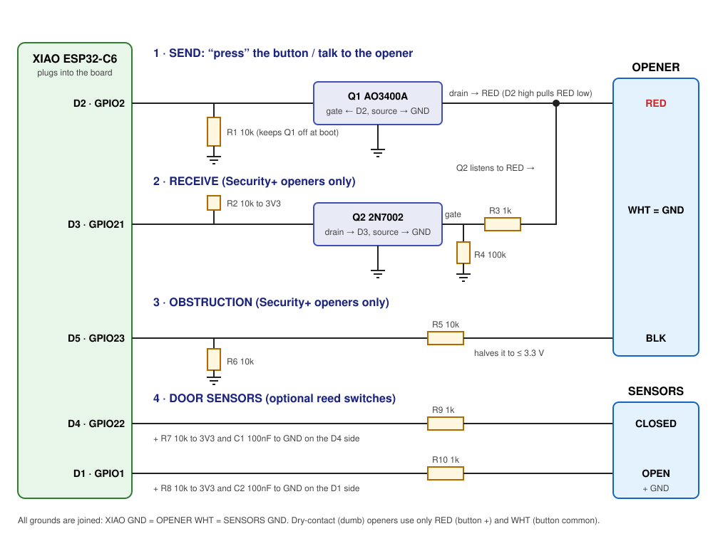

# How the circuit works

The board has four small blocks:

## 1. Send: "press" the button

**Q1 (AO3400A)** is an electronic switch between the **RED** wire and ground.

- **Dry-contact openers:** when the XIAO sets **D2** high for half a second, Q1 connects RED to ground. That's exactly what pressing the wall button does.
- **Security+ openers:** the same switch sends the data bits by pulling RED low very quickly. The red wire idles at about 12 V and the opener reads these pulses.

**R1 (10 kΩ)** holds Q1 **off** while the XIAO boots, so the door can't twitch during power-up.

## 2. Receive (Security+ only)

The opener sends its status (door position, light, lock, obstruction) back on the same RED wire. **Q2 (2N7002)** turns the 12 V signal into a safe 3.3 V signal on **D3**:
- RED high → Q2 on → D3 reads **low**;
- RED low → D3 reads **high**, through the R2 pull-up.

The signal is inverted, and the firmware expects that. **R3 (1 kΩ)** protects the gate, and **R4 (100 kΩ)** keeps Q2 off when nothing is connected.

## 3. Obstruction (Security+ only)

The **BLACK** wire carries the photo-eye signal. **R5/R6** halve it so the XIAO's **D5** never sees more than 3.3 V (as long as BLACK stays under about 7 V; we check this when installing).

## 4. Door sensors (optional)

Two inputs (**CLOSED** → D4, **OPEN** → D1) for magnetic reed switches that short to GND.
- **R7/R8:** 10 kΩ pull-ups to 3V3.
- **R9/R10:** 1 kΩ series resistors to protect against long-wire zaps.
- **C1/C2:** 100 nF to filter noise.

The dry-contact firmware uses CLOSED for real open/closed status. The Security+ firmware uses them as optional external open/close trigger inputs.

## Why these pins?

| Pin | Use | Notes |
|---|---|---|
| D2 (GPIO2) | Send | A safe general-purpose pin |
| D3 (GPIO21) | Receive | |
| D5 (GPIO23) | Obstruction | |
| D4 (GPIO22) | CLOSED sensor | |
| D1 (GPIO1) | OPEN sensor | |
| **D6 (GPIO16)** | **avoided** | It's the C6's boot serial output and would pulse the door wire every boot. |
| GPIO 8, 9, 15 | **avoided** | Strapping pins |
| GPIO 3 / 14 | (used internally) | The XIAO C6's antenna switch; the firmware selects the built-in antenna. |

## Where it came from

The send / receive / obstruction circuit is the community [rat-ratgdo](https://github.com/Kaldek/rat-ratgdo) design (MIT), adapted to the XIAO ESP32-C6. The Security+ protocol handling is [esphome-ratgdo](https://github.com/ratgdo/esphome-ratgdo).
