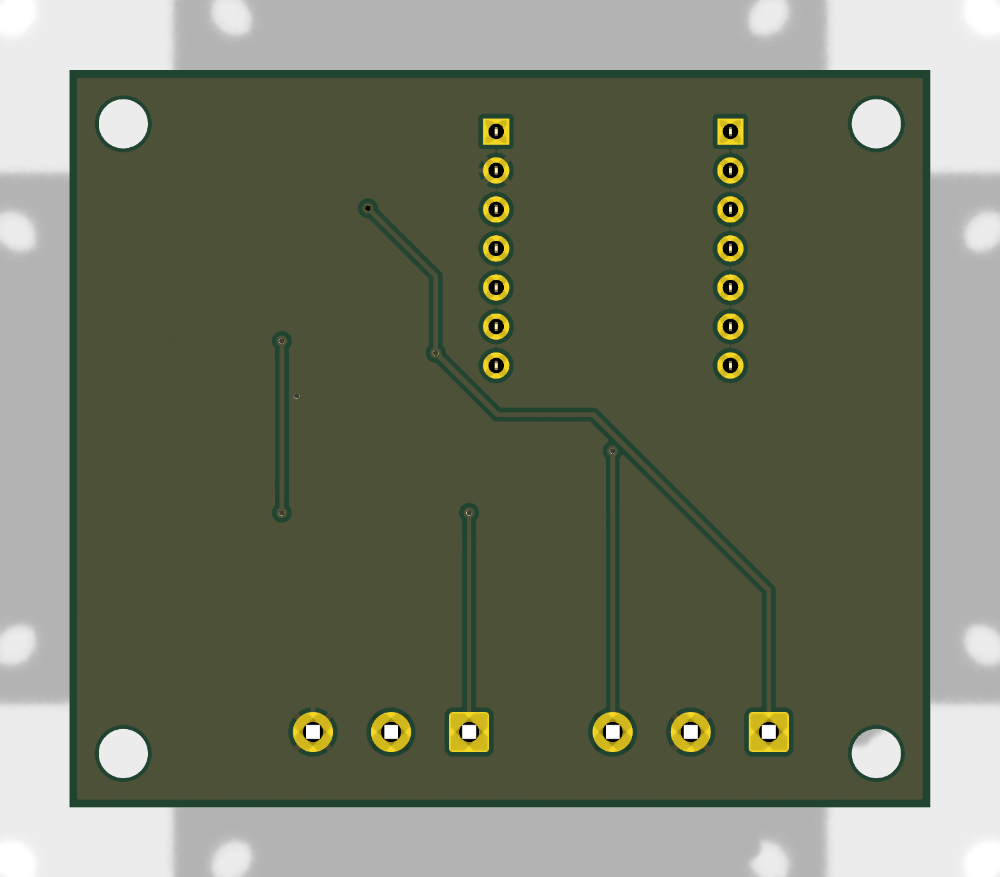

# Order the ready-made PCB

A board house builds and assembles the board for you: all the small parts, the XIAO sockets and the screw terminals. When it arrives you **just plug in your XIAO**. No soldering at all.

| Top | Bottom |
|---|---|
|  |  |

**Board:** 56 × 48 mm, 2 layers, 4 × M3 mounting holes.

## Download the files

| File | What it is |
|---|---|
| [`garage_door_gerbers.zip`](https://github.com/JamesSilvia20/xiao-garage-door/raw/main/hardware/pcb/jlcpcb/garage_door_gerbers.zip) | The board itself (Gerbers + drill files). Upload this first. |
| [`garage_door_bom.csv`](https://github.com/JamesSilvia20/xiao-garage-door/raw/main/hardware/pcb/jlcpcb/garage_door_bom.csv) | JLCPCB parts list (with LCSC part numbers) |
| [`garage_door_cpl.csv`](https://github.com/JamesSilvia20/xiao-garage-door/raw/main/hardware/pcb/jlcpcb/garage_door_cpl.csv) | JLCPCB placement file |
| [`garage_door_bom_pcbway.csv`](https://github.com/JamesSilvia20/xiao-garage-door/raw/main/hardware/pcb/pcbway/garage_door_bom_pcbway.csv) | PCBWay parts list (manufacturer part numbers) |
| [`garage_door_centroid_pcbway.csv`](https://github.com/JamesSilvia20/xiao-garage-door/raw/main/hardware/pcb/pcbway/garage_door_centroid_pcbway.csv) | PCBWay placement file |

## Option 1: JLCPCB (exact price right away)

1. Go to **[jlcpcb.com](https://jlcpcb.com)** → **Instant Quote**, and upload **`garage_door_gerbers.zip`**. It should detect **2 layers, 56 × 48 mm**. Leave everything else on the defaults; any color is fine.
2. Scroll down and switch **PCB Assembly** **on**.
   - **PCBA Type:** Economic
   - **Assembly Side:** Top
   - **PCBA Qty:** 2 or 5 (5 gives spares for friends)
3. Click **Next**, then sign in (or make a free account).
4. Upload **`garage_door_bom.csv`** (BOM) and **`garage_door_cpl.csv`** (CPL), then click **Process BOM & CPL**.
5. **Check the parts list.** All 10 lines should match:

   | Designator | Part | LCSC |
   |---|---|---|
   | C1–C3 | 100 nF | C14663 |
   | J1, J2 | Screw terminal 3P 5.08 mm | C474953 |
   | J3, J4 | Female header 1×7 2.54 mm (XIAO sockets) | C2932672 |
   | Q1 | AO3400A | C20917 |
   | Q2 | 2N7002 | C8545 |
   | R1, R2, R5–R8 | 10 kΩ | C25804 |
   | R3, R9, R10 | 1 kΩ | C21190 |
   | R4 | 100 kΩ | C25803 |

   > [!IMPORTANT]
   > JLCPCB may leave **J1–J4 unticked** with a ⚠️ saying "multiple lines matched the same part". That's expected, because the two terminals share one part and the two sockets share another. **Tick all four** or your board arrives without sockets and terminals.

6. **Check the placement preview.** The two small 3-pin transistors (**Q1** near "SEND", **Q2** near "RECV") must have their pin-1 dot on the side with **two** pins, matching the white dot on the board. If one looks spun around, rotate it 180° in the preview. JLCPCB's engineers also check this after you order.
7. Pick a **Product Description** for customs (for example "DIY / hobby"), **Save to Cart**, choose shipping, and pay.

**Example price (Oct 2026):** $4 for the boards + about $20 assembly = **about $24**, plus shipping.

## Option 2: PCBWay (price after review)

1. Go to **[pcbway.com](https://www.pcbway.com)** → **PCB Assembly**, and enter **Quantity 5, Unique parts 8, SMD parts 15, Thru-holes 4**. Click **Quote & Order**.
2. Keep **Turnkey** (PCBWay buys the parts), Single pieces, Top side, then **Save to Cart** (sign in).
3. In the upload box: Gerbers = **`garage_door_gerbers.zip`**, BOM = **`garage_door_bom_pcbway.csv`**, Centroid = **`garage_door_centroid_pcbway.csv`**. Click **Submit**.
4. PCBWay reviews the files (usually within 1–2 days) and emails the final price, including the board and parts. Nothing is charged until you pay.

**Example estimate (Oct 2026):** $29 assembly + board + parts, with shipping discounted. That came to **about $40 total**.

## When it arrives

1. **Check the XIAO orientation:** the board shows the outline. **USB-C faces the top edge, chips face up.**
2. Push the XIAO (with its pins) into the two sockets.
3. Go to [Flash the firmware →](../setup/flash.md)
