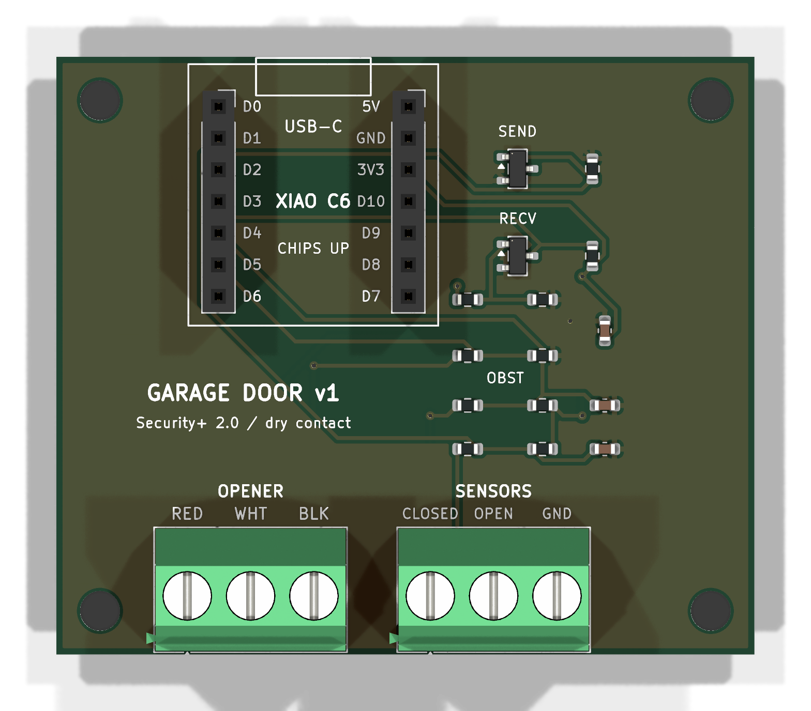

# XIAO Garage Door

**Make your garage door opener smart for about $10 in parts.** A tiny open-source board holds a Seeed Studio XIAO ESP32-C6 and wires to your opener's wall-button terminals. Then you can open and close your garage from **Home Assistant**, **Apple Home** (with Siri and automations), or anything that talks to ESPHome. No cloud, no subscription.

## Works with

| Your opener | What you get |
|---|---|
| **Security+ 2.0** (LiftMaster / Chamberlain / Craftsman, **yellow** learn button, myQ) | Real status from the opener: open / closed / opening / closing, light, lock, obstruction, motion. |
| **Security+ 1.0** (same brands, **purple / red / orange** learn button) | Same as above. |
| **Any opener with a simple 2-wire wall button** | Open / close / stop. Add a reed switch for real status. |

## Follow the guides in order

1. [Which opener do I have?](start/which-opener.md)
2. [Parts and cost](start/parts.md)
3. [Safety first](start/safety.md)
4. Get the hardware: [order the ready-made PCB](hardware/order-pcb.md) **or** [build it on perfboard](hardware/perfboard.md) ([Soldering 101](hardware/soldering-101.md))
5. [Flash the firmware](setup/flash.md) using the [browser installer](install/index.md)
6. [Add to Home Assistant](setup/home-assistant.md) and [Apple Home](setup/apple-home.md)
7. [Install it at the opener](setup/install.md)

Stuck? See [Troubleshooting](help/troubleshooting.md) and the [FAQ](help/faq.md).

> [!NOTE]
> Everything here lives in the [GitHub repo](https://github.com/JamesSilvia20/xiao-garage-door). These pages are the same Markdown files you can read right on GitHub.
